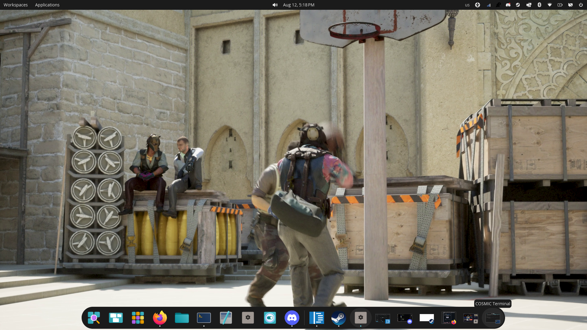
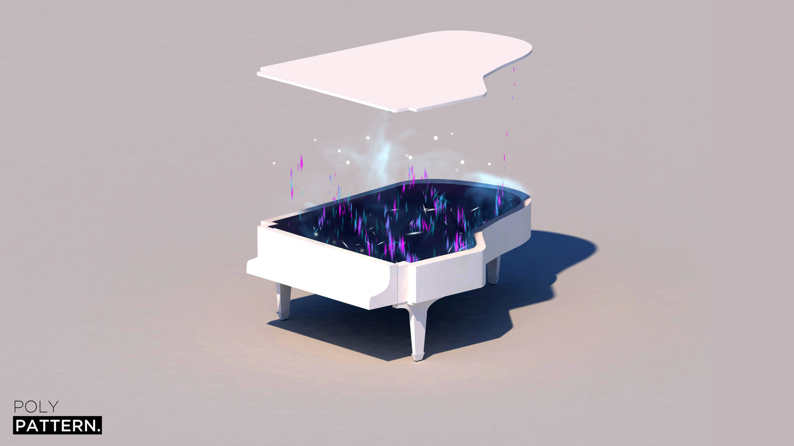
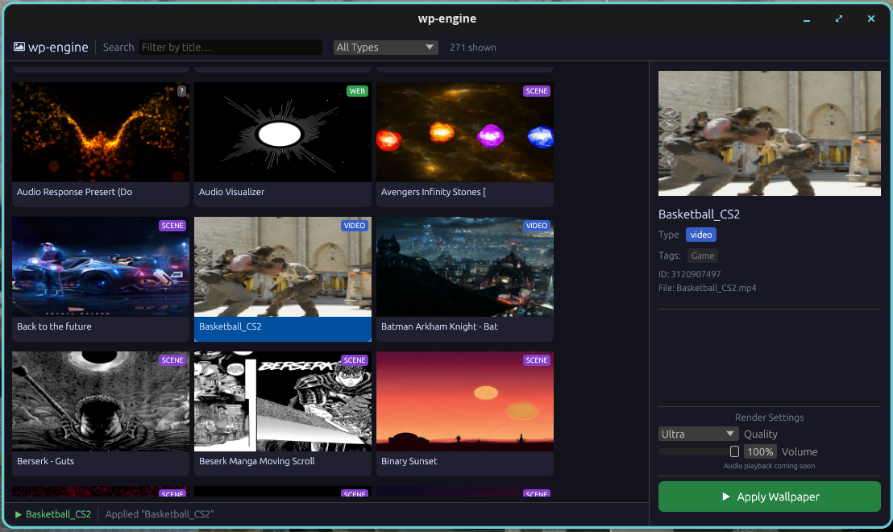

# wp-engine

<p>
  <a href="LICENSE"></a>
  
  
  
</p>

**Renders**&nbsp;


**Presents on**&nbsp;


**Built on**&nbsp;


A Wallpaper Engine client for Linux and macOS, written in Rust.

`wp-engine` plays Steam Workshop wallpapers on your desktop: animated **scene**
wallpapers rendered through a `wgpu` pass pipeline, plus video, image, and
(optionally) web wallpapers. It reads Wallpaper Engine's own formats directly —
`scene.json`, `.pkg` archives, `.tex` textures, `.mdl` models — so Workshop
items you already own work as-is.

The scene renderer is a port of
[linux-wallpaperengine](https://github.com/Almamu/linux-wallpaperengine); a
great deal of the maths here is based on that project's work. See
[Credits](#credits).



| | | |
| --- | --- | --- |
|  |  |  |
| Scene passes and effects | Scripted live text | Particles, audio reactive |

---

## Contents

- [Highlights](#highlights)
- [Requirements](#requirements)
- [Installation](#installation)
- [Usage](#usage)
- [Configuration](#configuration)
- [Project status](#project-status)
- [Architecture](#architecture)
- [Development](#development)
- [Troubleshooting](#troubleshooting)
- [Credits](#credits)
- [License](#license)

## Highlights

| | |
| --- | --- |
| **Scene wallpapers** | The full pass model — material and effect passes, ping-pong FBOs, named render targets, multi-pass effects, and the bloom chain |
| **Particles** | Every emitter, initializer, operator, and renderer type the Workshop corpus uses, including rope/trail geometry and textured sprites |
| **Shader translation** | Workshop GLSL compiled to SPIR-V and translated to WGSL at load, with repair passes for the legacy GLSL real wallpapers ship |
| **Audio reactive** | Desktop audio captured and FFT'd into the `g_AudioSpectrum*` uniforms, driving visualisers and particle emission |
| **Scripting** | Wallpaper Engine's SceneScript property scripts, for live text, opacity, visibility, and transforms |
| **Puppets and 3D** | `.mdl` skeletal meshes with skinning and animation layers, and perspective scenes |
| **Native presentation** | Direct `wgpu::Surface` presentation on Wayland — no readback — with X11 and macOS paths and a CPU fallback everywhere |

## Requirements

- **Rust** (stable) and Cargo
- **A GPU with Vulkan or Metal** — a software rasteriser works but is slow
- **shaderc** — GLSL to SPIR-V, for the shader translation layer
- **FFmpeg 9 or newer** — video decoding
- **Wallpaper Engine content** — Workshop items under your Steam library. The
  app finds them automatically.

Presentation needs one of:

| Platform | Requirement |
| --- | --- |
| Wayland | a compositor with `wlr-layer-shell` (Sway, Hyprland, river, labwc, wayfire, …) |
| X11 | any window manager |
| macOS | no extra requirement |

Windows is out of scope — see [Project status](#project-status).

## Installation

Install the two native libraries first. Cargo links against them and cannot
fetch them like crates:

```bash
# Debian / Ubuntu
sudo apt install libshaderc-dev ffmpeg

# Arch
sudo pacman -S shaderc ffmpeg

# macOS
brew install shaderc ffmpeg
```

Then build:

```bash
git clone https://github.com/code-wolf-byte/wp-engine
cd wp-engine
cargo build --release
```

The binary lands at `target/release/wp-engine`.

On macOS, Homebrew's prefix is not on `shaderc-sys`'s search path, so point the
build at it:

```bash
export SHADERC_LIB_DIR=/opt/homebrew/lib
```

Keep that out of version control — a committed global path breaks Linux builds.

### Web wallpapers (optional)

Web wallpapers need an embedded Chromium and sit behind an off-by-default cargo
feature:

```bash
cargo build --release --features web
```

The first such build downloads the CEF binary distribution (~400 MB extracted)
and places `libcef.so`, Chromium's resource blobs, and `locales/` beside the
binary; `build.rs` adds an `$ORIGIN` rpath so it finds them. Set `CEF_PATH` to
reuse an existing CEF distribution instead of downloading one.

Leave the feature off unless you need web wallpapers — the default build touches
none of this, and without it web wallpapers report that the binary lacks web
support rather than failing obscurely.

## Usage

Run with no arguments for the graphical browser:

```bash
wp-engine
```



Or drive it from the command line:

```bash
# List everything Wallpaper Engine has installed
wp-engine list

# Apply a wallpaper by Workshop ID (blocks until Ctrl-C)
wp-engine set 1275921440

# Apply any scene directory, video, image, or HTML file
wp-engine set-file ~/wallpapers/my-scene/

# Override a wallpaper's user properties (repeatable)
wp-engine set 1275921440 --set-property "schemecolor=1 0.2 0.2"
```

| Command | Purpose |
| --- | --- |
| `list` | List installed Workshop wallpapers |
| `set <id>` | Apply a wallpaper by Workshop ID |
| `set-file <path>` | Apply a scene directory, video, image, or HTML file |
| `info <id>` | Show a Workshop item's metadata |
| `list-properties <id>` | Show the properties a wallpaper exposes |
| `probe` | List GPU adapters visible to the process |
| `pkg-info <path>` | Inspect or extract a `.pkg` archive |
| `tex-info <path>` | Inspect a `.tex` texture |
| `render-scene <id>` | Render one frame to a PNG |
| `preview-scene <id>` | Preview an animated scene in a window |
| `test-scene <id>` | Check that a scene animates, headless |

Add `-v` for debug logging, `-vv` for trace. `RUST_LOG` overrides both.

## Configuration

### User properties

Wallpapers expose their own settings — colours, speeds, toggles. List them with
`wp-engine list-properties <id>` and override them with `--set-property
NAME=VALUE`, which is applied before `scene.json` is parsed.

### Environment variables

| Variable | Effect |
| --- | --- |
| `WP_ENGINE_FORCE_X11=1` | Take the X11 path even under a Wayland session |
| `WP_ENGINE_FORCE_SHM=1` | Force the CPU/SHM presentation path |
| `WP_ENGINE_SKIP_EFFECTS=a,b` | Disable named effects |
| `CEF_PATH` | Reuse an existing CEF distribution instead of downloading one |
| `SHADERC_LIB_DIR` | Where to find shaderc, if not on the default search path |
| `RUST_LOG` | Standard `tracing` filter; overrides `-v` |

Diagnostic dumps are listed under [Troubleshooting](#troubleshooting).

## Project status

The scene renderer targets the Workshop corpus rather than the format's full
theoretical surface: features are measured against real wallpapers before being
built, and several are deliberately skipped as unreachable.

<details>
<summary><strong>Implemented</strong></summary>

- asset store for loose files and PKG archives
- tolerant `scene.json` parsing with user-property resolution
- model/material/effect parsing
- GLSL→WGSL shader translation (shaderc + Naga) with std140 uniform packing and
  the legacy-GLSL repair passes real workshop shaders need
- full effect pass chaining: ping-pong FBOs, named effect FBOs (`target`/`bind`),
  multi-pass effects, per-object composite buffers, reference bloom chain
- per-object quad placement (WE scene coordinates, Y-up), layer alignment,
  parent-chain transforms, true z-order interleaving
- particles: every emitter/initializer/operator/renderer type the corpus uses,
  including rope/trail renderers, textured sprites, child systems, and
  audio-reactive emission
- puppet `.mdl` mesh loading with bones, skinning, and animation layers
- text objects: system + bundled fonts, wrapping, alignment, backgrounds
- light and sound objects
- SceneScript property scripting (text, alpha, visible, scale, origin, angles)
- audio reactivity: desktop capture → FFT → `g_AudioSpectrum*` uniforms
- camera shake / fade / parallax, driven by the real cursor
- 3D perspective scenes with meshes
- video wallpapers, and embedded-video `.tex` layers, streamed with FFmpeg
- web (HTML) wallpapers via CEF, with the WE browser API bridge
  (`wallpaperPropertyListener`, `wallpaperRegisterAudioListener`)
- presentation: Wayland layer-shell (direct `wgpu::Surface`, no readback),
  X11 root pixmap, macOS desktop window, CPU/SHM fallback everywhere
- application lifecycle (`WallpaperApplication`, `--set-property`, signals)

</details>

<details>
<summary><strong>Known gaps</strong></summary>

- **screen-space backdrop capture** for refraction/distortion effects
  (waterripple/waterflow): their hidden `g_Texture0` is meant to sample the scene
  behind the layer, but we default it to the layer's own base texture, so water
  effects distort themselves. Currently softened with a brightness band-aid.
- MPRIS media integration, and the media/plugin halves of the web JS bridge
- mouse/keyboard input forwarding into web wallpapers (they render, but do not
  respond to the cursor); web wallpapers also render at a fixed 1080p
- per-object cameras (3 wallpapers in the local corpus)
- normal-mapped lighting, shadows, volumetrics, GPU instancing, and a true depth
  buffer — all measured against the corpus and found to have zero or near-zero
  reach, so they are deliberately not planned rather than merely missing

</details>

<details>
<summary><strong>Out of scope</strong></summary>

- **Windows.** The renderer is portable (wgpu), but there is no `WorkerW`
  platform module and no way to test one from the Linux/macOS development
  environment. `application` (Windows-only `.exe`) wallpapers likewise.

</details>

## Architecture

A wallpaper becomes pixels in stages: content detection, asset mounting, tolerant
`scene.json` parsing, model/material/effect resolution, scene-graph composition,
shader translation, then the GPU pass pipeline and platform presentation.

**[Read the full architecture guide →](ARCHITECTURE.md)**

## Development

```bash
cargo fmt
cargo clippy
cargo test
```

`cargo test` runs the unit suite. For rendering work, `test-scene` is the fastest
signal — it drives the real GPU path headlessly, so it catches what unit tests
cannot.

## Troubleshooting

**Nothing appears on Wayland.** The compositor needs `wlr-layer-shell`. GNOME
does not implement it; use the X11 path there with `WP_ENGINE_FORCE_X11=1`.

**A wallpaper renders wrongly.** Reach for the dumps before reading code:

- `wp-engine test-scene <id>` — headless animation check
- `WP_DEBUG_DUMP_FRAME=path` — save the last GPU frame (the only way to inspect
  the live path off-screen)
- `WP_DEBUG_DUMP_FBOS=1` — dump every pooled render target per frame
- `WP_DEBUG_DUMP_WGSL=1` / `WP_DEBUG_DUMP_GLSL=1` — dump translated WGSL, or the
  generated GLSL of any shader that fails to compile
- `WP_DEBUG_TEX_SLOTS=1` — dump effect texture-slot resolution
- `WP_DEBUG_PARTICLE_TIMING=1` — per-system particle cost, for "why is this slow"
- `WP_ENGINE_SKIP_EFFECTS=name1,name2` — disable specific effects. Note the
  hardcoded kernels (pulse/scroll/shake/tint/opacity/waterripple/waterwaves/spin)
  never log a load line, so read the object's effect list from `scene.json`
  rather than trusting the log when bisecting.
- `WP_ENGINE_FORCE_SHM=1` — force the CPU/SHM presentation path
- `WP_ENGINE_FORCE_X11=1` — take the X11 path even under a Wayland session

**A web wallpaper says the binary lacks web support.** It was built without
`--features web`; see [Installation](#installation).

## Credits

This project would not exist without
**[Almamu/linux-wallpaperengine](https://github.com/Almamu/linux-wallpaperengine)**
— Almamu's C++ reverse-engineering of Wallpaper Engine's scene format and
renderer.

A great deal of the maths in this codebase is based on the work done there. The
formats and formulae were derived by that project first, and this port follows
them:

- the pass model: material and effect passes, ping-pong FBOs, named render
  targets, and the bloom chain
- particle simulation — emitter shapes, initializers, and the operator formulae
  (`alphafade`, `sizechange`, the oscillators, `colorchange`,
  `controlpointattract`) follow `CParticle.cpp`
- the `.tex` container format, the `.mdl` mesh layout, and the texture/model
  chain resolution rules
- scene coordinates, layer alignment and quad placement (`CImage.cpp`), and text
  layout (`CText.cpp`)
- camera parallax and fade, and the pointer-position convention
- shader translation: uniform naming, combo handling, and the binding rules
  `CPass.cpp` establishes

Some parts went further than the reference and are original work here, informed
by its groundwork rather than ported from it: the puppet `.mdl` skeleton and
animation tracks (the reference reads only the mesh, and rejects the format
version these files use), rope/trail particle geometry, and the Wallpaper Engine
JavaScript bridge for web wallpapers.

Where this port deviates deliberately, the reason is recorded in a comment next
to the code (camera shake, for instance, is applied here even though the
reference parses but never applies it).

The reference implementation is not redistributed here — `cpp-implementation/`
is gitignored, and is a local checkout used as read-only reference material
while porting. Clone it yourself from the link above if you want to compare.

Wallpaper Engine itself is a product of Kristjan Skutta. This project is not
affiliated with, endorsed by, or derived from its source.

## License

Licensed under the **GNU General Public License v3.0** — see [LICENSE](LICENSE).

`linux-wallpaperengine`, which this project derives from and whose maths it is
based on, is GPL-3.0. As a derivative work this project carries the same license.
Upstream ships the GPL-3 text with no "or any later version" grant, so this is
GPL-3.0-only rather than -or-later.
